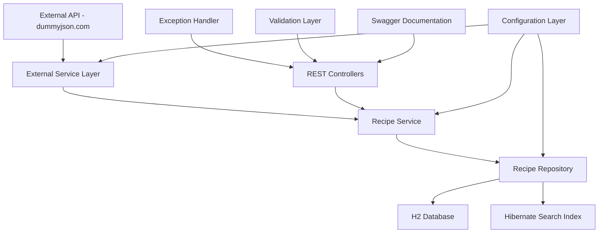
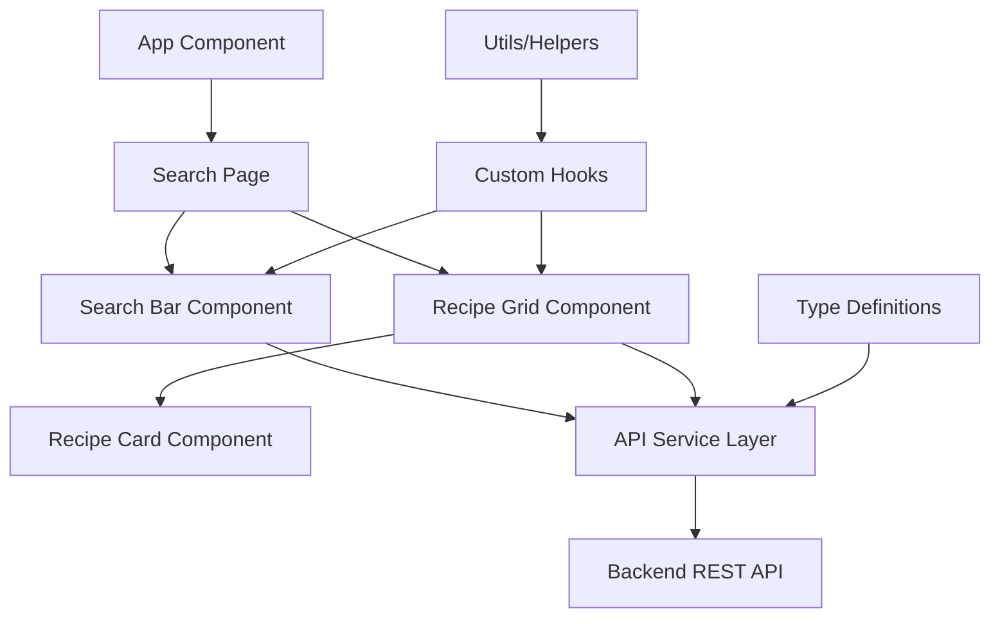
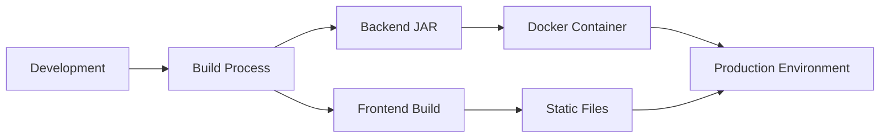

# Recipe Management System - Architecture Overview

## Project Structure
```
publicis/
├── backend/                    # Spring Boot Application
│   ├── src/main/java/
│   │   └── com/publicis/recipes/
│   │       ├── RecipeApplication.java
│   │       ├── config/         # Configuration classes
│   │       ├── controller/     # REST Controllers
│   │       ├── service/        # Business Logic
│   │       ├── repository/     # Data Access Layer
│   │       ├── entity/         # JPA Entities
│   │       ├── dto/            # Data Transfer Objects
│   │       ├── exception/      # Custom Exceptions
│   │       └── external/       # External API clients
│   ├── src/main/resources/
│   │   ├── application.yml
│   │   └── logback-spring.xml
│   ├── src/test/java/          # Unit Tests
│   └── pom.xml
├── frontend/                   # React TypeScript Application
│   ├── public/
│   ├── src/
│   │   ├── components/         # Atomic Design Structure
│   │   │   ├── atoms/
│   │   │   ├── molecules/
│   │   │   ├── organisms/
│   │   │   └── templates/
│   │   ├── pages/
│   │   ├── services/           # API Services
│   │   ├── hooks/              # Custom React Hooks
│   │   ├── types/              # TypeScript Definitions
│   │   ├── utils/              # Utility Functions
│   │   └── styles/             # CSS/SCSS Files
│   ├── package.json
│   └── tsconfig.json
└── README.md
```

## Technology Stack

### Backend
- **Framework**: Spring Boot 3.x with Java 17+
- **Database**: H2 In-Memory Database
- **Search**: Hibernate Search 6.x with Lucene
- **Documentation**: SpringDoc OpenAPI 3 (Swagger)
- **Testing**: JUnit 5, Mockito, TestContainers
- **Build Tool**: Maven
- **Resilience**: Spring Retry, Circuit Breaker
- **Validation**: Bean Validation (JSR-303)
- **Logging**: SLF4J with Logback

### Frontend
- **Framework**: React 18+ with TypeScript
- **Build Tool**: Vite
- **Styling**: CSS Modules + SCSS
- **State Management**: React Context + useReducer
- **HTTP Client**: Axios
- **Testing**: Jest, React Testing Library
- **UI Components**: Custom components following Atomic Design
- **Responsive Design**: CSS Grid + Flexbox

## System Architecture

### Backend Architecture



### Frontend Architecture



## Key Features Implementation

### Backend Features

1. **Data Loading**
   - Fetch recipes from https://dummyjson.com/recipes
   - Resilient HTTP client with retry mechanism
   - Circuit breaker pattern for external API calls
   - Data transformation and validation

2. **Search Functionality**
   - Hibernate Search with Lucene indexing
   - Full-text search on recipe name and cuisine
   - Optimized query performance

3. **REST API Endpoints**
   - `GET /api/recipes/search?q={query}` - Search recipes
   - `GET /api/recipes/{id}` - Get recipe by ID
   - `POST /api/recipes/load` - Load data from external API

4. **Quality Assurance**
   - Comprehensive exception handling
   - Input validation with Bean Validation
   - Structured logging with correlation IDs
   - Unit tests with 80%+ coverage

### Frontend Features

1. **Search Interface**
   - Global search bar with debounced input
   - Auto-trigger search after 3 characters
   - Loading states and error handling

2. **Recipe Display**
   - Responsive grid layout
   - Lazy loading for images
   - Client-side sorting by cookTimeMinutes
   - Client-side filtering by tags

3. **User Experience**
   - Single Page Application (SPA)
   - Mobile-first responsive design
   - Smooth animations and transitions
   - Accessibility compliance

## Performance Optimizations

### Backend
- Connection pooling for H2 database
- Hibernate Search indexing for fast queries
- Caching for external API responses
- Async processing for data loading

### Frontend
- Code splitting with React.lazy()
- Image lazy loading
- Debounced search input
- Virtual scrolling for large datasets
- Memoization of expensive computations

## Security Considerations

- Input validation and sanitization
- CORS configuration
- Rate limiting for API endpoints
- Error message sanitization
- Secure headers configuration

## Testing Strategy

### Backend Testing
- Unit tests for all service layers
- Integration tests for repositories
- API endpoint testing with MockMvc
- External API mocking

### Frontend Testing
- Component unit tests
- Integration tests for user flows
- API service mocking
- Accessibility testing

## Deployment Architecture



## Configuration Management

### Backend Configuration
- Environment-specific application.yml files
- Externalized configuration for API URLs
- Database connection settings
- Logging levels per environment

### Frontend Configuration
- Environment variables for API endpoints
- Build-time configuration
- Feature flags for development

This architecture ensures scalability, maintainability, and follows industry best practices for both backend and frontend development.